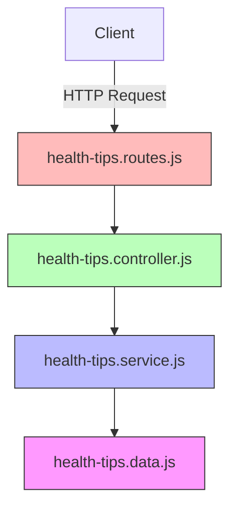

# Tài liệu Thiết kế - Health Tips (Module C)

## Tổng quan

Module Health Tips cung cấp API công khai để lấy mẹo sức khỏe bằng tiếng Việt cho hệ thống HealthGuard. Module sử dụng dữ liệu hardcode ban đầu nhưng được thiết kế theo kiến trúc phân tầng (data store → service → controller → route) để dễ dàng thay thế nguồn dữ liệu trong tương lai.

Các endpoint chính:
- `GET /api/v1/health-tips` — Lấy toàn bộ mẹo, hỗ trợ lọc theo category
- `GET /api/v1/health-tips/random` — Lấy mẹo ngẫu nhiên, hỗ trợ `count` và `category`
- `GET /api/v1/health-tips/categories` — Lấy danh sách danh mục

Không yêu cầu xác thực. Response tuân theo format `{ status: "success", data: [...] }` nhất quán với hệ thống hiện tại.

## Kiến trúc

Module tuân theo kiến trúc phân tầng hiện có của project:



**Luồng xử lý:**
1. Route nhận request, không áp dụng middleware xác thực
2. Controller parse/validate query params, gọi service
3. Service chứa business logic (lọc, chọn ngẫu nhiên)
4. Data store export dữ liệu hardcode dưới dạng ES module

**Quyết định thiết kế:**
- Tách data store thành file riêng (`health-tips.data.js`) thay vì nhúng trong service → cho phép thay thế nguồn dữ liệu mà không sửa logic
- Không tạo Prisma model vì dữ liệu hardcode, nhưng cấu trúc `tags` và `relatedMetrics` tương thích với schema HealthMetric hiện tại
- Service nhận data store qua tham số (dependency injection đơn giản) để dễ test

## Thành phần và Giao diện

### 1. Data Store (`src/data/health-tips.data.js`)

```javascript
// Export mảng health tips và map tên danh mục tiếng Việt
export const healthTips = [ /* ... */ ];
export const categoryNames = {
  sleep: "Giấc ngủ",
  heart: "Tim mạch",
  nutrition: "Dinh dưỡng",
  exercise: "Vận động",
  stress: "Căng thẳng",
  general: "Tổng quát"
};
```

### 2. Service (`src/services/health-tips.service.js`)

```javascript
/**
 * @param {Object} options
 * @param {string} [options.category] - Danh mục cần lọc
 * @returns {Array<HealthTip>} - Danh sách tips đã lọc
 */
export function getAllTips(options = {})

/**
 * @param {Object} options
 * @param {number} [options.count=1] - Số lượng tips ngẫu nhiên
 * @param {string} [options.category] - Danh mục cần lọc
 * @returns {Array<HealthTip>} - Danh sách tips ngẫu nhiên không trùng lặp
 */
export function getRandomTips(options = {})

/**
 * @returns {Array<{key: string, name: string, count: number}>}
 */
export function getCategories()

/**
 * @param {string} category
 * @returns {boolean}
 */
export function isValidCategory(category)
```

### 3. Controller (`src/controllers/health-tips.controller.js`)

```javascript
// GET /api/v1/health-tips
export const getAllHealthTips = async (req, res) => { /* ... */ }

// GET /api/v1/health-tips/random
export const getRandomHealthTips = async (req, res) => { /* ... */ }

// GET /api/v1/health-tips/categories
export const getHealthTipCategories = async (req, res) => { /* ... */ }
```

### 4. Routes (`src/routes/health-tips.routes.js`)

```javascript
router.get('/', getAllHealthTips);
router.get('/random', getRandomHealthTips);
router.get('/categories', getHealthTipCategories);
```

**Lưu ý:** Không sử dụng `verifyToken` middleware vì endpoint công khai (Yêu cầu 7.2).

## Mô hình Dữ liệu

### HealthTip Object

```javascript
{
  id: "tip_001",              // string - ID duy nhất
  title: "Ngủ đủ giấc",       // string - Tiêu đề ngắn gọn
  content: "Ngủ 7-8 tiếng...",// string - Nội dung chi tiết
  category: "sleep",          // string - Danh mục (sleep|heart|nutrition|exercise|stress|general)
  tags: ["sleep_duration"],   // string[] - Liên kết với HealthMetric fields
  source: "WHO",              // string? - Nguồn tham khảo (tùy chọn)
  relatedMetrics: ["sleep_duration", "stress_level"]  // string? - Trường trong HealthMetric/HealthProfile
}
```

### Danh mục hợp lệ

| Key        | Tên tiếng Việt | Mô tả                    |
|------------|----------------|---------------------------|
| sleep      | Giấc ngủ       | Mẹo về giấc ngủ          |
| heart      | Tim mạch       | Mẹo về sức khỏe tim mạch |
| nutrition  | Dinh dưỡng     | Mẹo về dinh dưỡng        |
| exercise   | Vận động       | Mẹo về tập luyện         |
| stress     | Căng thẳng     | Mẹo giảm căng thẳng      |
| general    | Tổng quát      | Mẹo sức khỏe chung       |

### Tags hợp lệ (tương thích HealthMetric schema)

`heart_rate`, `steps`, `sleep_duration`, `stress_level`, `hrv`, `spo2`

### Response Formats

**GET /api/v1/health-tips**
```json
{
  "status": "success",
  "count": 15,
  "data": [ { "id": "tip_001", "title": "...", ... } ]
}
```

**GET /api/v1/health-tips/random?count=3&category=sleep**
```json
{
  "status": "success",
  "data": [ { "id": "tip_003", "title": "...", ... } ]
}
```

**GET /api/v1/health-tips/categories**
```json
{
  "status": "success",
  "data": [
    { "key": "sleep", "name": "Giấc ngủ", "count": 3 }
  ]
}
```

**Error Response (400/500)**
```json
{
  "status": "error",
  "message": "Giá trị count phải là số nguyên dương"
}
```
